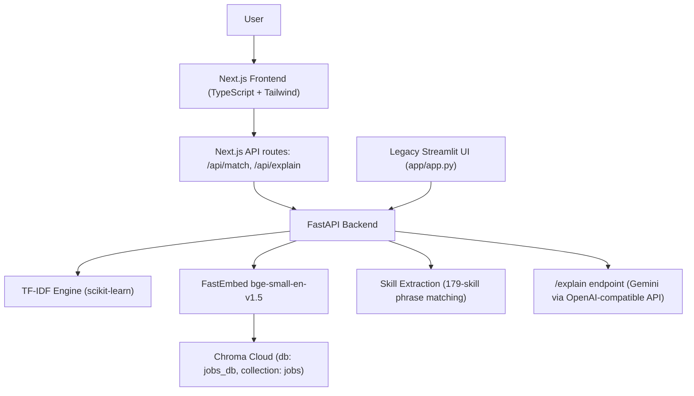

# Resume Job Matcher

Semantic resume-to-job matching. Upload a PDF resume and rank **680 real Indeed job postings** with three methods: classic **TF-IDF**, **semantic embeddings** (FastEmbed + Chroma Cloud), and a **hybrid** score that also explains matched/missing skills — with optional **Gemini-powered** "Why this match?" explanations.

**Live endpoints:** FastAPI on Render · Next.js UI on Vercel (URLs added once deployed).

## The problem

Keyword matching alone misses semantically relevant jobs ("customer churn modeling" vs "predictive analytics"). This app combines TF-IDF, embeddings and skill-extraction so results are both accurate and **explainable**.

## Architecture



## Matching process

```text
Resume PDF → pypdf text extraction
  ├─ tfidf:      TF-IDF + cosine similarity over all jobs
  ├─ embeddings: resume embedding → Chroma top-50 → semantic ranking
  └─ hybrid:     0.7 × semantic_similarity + 0.3 × skill_overlap
→ ranked jobs with matched_skills / missing_skills
```

Weights live in `backend/semantic_matcher.py` (`SEMANTIC_WEIGHT`, `SKILL_WEIGHT`).

**Why FastEmbed instead of sentence-transformers:** ONNX-based, no PyTorch, roughly 10× lower RAM — fits a 512 MB free-tier host.

## Environment variables

Backend reads `.env` (copy `.env.example`). Frontend reads `frontend/.env.local` (copy `frontend/.env.example`). **No secret is ever committed or sent to the browser** — the UI only calls the Next.js API routes, which proxy server-side to FastAPI.

| Variable          | Required | Purpose                                                        |
| ----------------- | -------- | -------------------------------------------------------------- |
| CHROMA_API_KEY    | Yes      | Chroma Cloud auth (embeddings/hybrid)                          |
| CHROMA_TENANT     | Yes      | Chroma tenant id                                               |
| CHROMA_DATABASE   | Yes      | Chroma database name (`jobs_db` in this project)               |
| LLM_API_KEY       | No       | Gemini (or any OpenAI-compatible) key for `/explain`           |
| LLM_BASE_URL      | No       | Defaults to `https://generativelanguage.googleapis.com/v1beta/openai` |
| LLM_MODEL         | No       | Defaults to `gpt-4o-mini`; this project uses `gemini-2.5-flash` |
| BACKEND_URL       | Yes      | FastAPI URL — server-side only in Next.js (never `NEXT_PUBLIC_*`) |
| FRONTEND_ORIGIN   | Yes      | CORS allowlist (never `*`)                                     |

## Local setup

```bash
git clone https://github.com/shreychauhan02/job_recommeder.git
cd job_recommeder
python -m venv .venv && .venv\Scripts\activate   # Windows
pip install -r requirements.txt
copy .env.example .env        # fill in CHROMA_* (and LLM_API_KEY for explanations)

# 1. Index jobs into Chroma Cloud (idempotent — 575 docs from 680 rows)
python scripts/index_jobs.py

# 2. Backend → http://localhost:8000 (docs at /docs)
uvicorn backend.main:app --port 8000

# 3. Frontend → http://localhost:3000
cd frontend && npm install && copy .env.example .env.local && npm run dev

# (optional) legacy Streamlit UI
streamlit run app/app.py
```

## Evaluation

Synthetic resumes in `evaluation/resumes/` (created only for evaluation, not real people) with rule-based relevance labels in `evaluation/dataset.csv` (regenerate with `python evaluation/build_labels.py`). `evaluate.py` computes metrics from those labels — actual output from this dataset:

```text
Evaluating 10 synthetic resumes, 318 labeled pairs.

| Method | Precision@5 | MRR |
|--------|--------------|-----|
| TF-IDF | 0.440 | 0.636 |
| Embeddings | 0.700 | 0.825 |
| Hybrid | 0.580 | 0.867 |
```

Embeddings wins Precision@5; hybrid wins MRR (better first-relevant rank). Reproduce: `python evaluation/evaluate.py`.

## API

- `GET /health` — status + loaded job count
- `POST /match` — multipart: `file` (PDF, ≤5 MB), `method` (`tfidf|embeddings|hybrid`, default hybrid), `top_n`
- `POST /explain` — JSON: `resume_summary`, `title`, `company`, `matched_skills`, `missing_skills`. Returns `{"configured": false, "message": "LLM explanation is not configured."}` when `LLM_API_KEY` is absent — the rest of the app keeps working.

## Deployment

- **Backend → Render**: `Procfile` runs `uvicorn backend.main:app --host 0.0.0.0 --port $PORT`; `runtime.txt` pins Python 3.12. Add `CHROMA_API_KEY`, `CHROMA_TENANT`, `CHROMA_DATABASE`, `LLM_API_KEY`, and `FRONTEND_ORIGIN` (your Vercel URL) as environment variables in the Render dashboard. Free tier sleeps after inactivity — first request takes ~30 s.
- **Frontend → Vercel**: import the repo with root directory set to `frontend/`, and set `BACKEND_URL` to the Render URL as a **plain (server-side) env var** — do **not** use `NEXT_PUBLIC_BACKEND_URL`.

## Limitations

- Scraped Indeed dataset (~680 rows, Southeast-Asia-heavy) — small, and postings go stale.
- No location column in the dataset; `location` is returned empty.
- Evaluation resumes and labels are **synthetic and rule-based** (title-role matching), so Precision@5/MRR are indicative, not production-grade.
- `bge-small-en-v1.5` is a compact model; long job descriptions are truncated by the embedding window.
- Skill vocabulary is curated (179 terms); niche tools are missed.
- LLM explanations depend on Google's endpoint availability — `gemini-3.8-flash` returned 503 "high demand" during testing, so `gemini-2.5-flash` is pinned.

## Demo

`python scripts/index_jobs.py` → `uvicorn backend.main:app --port 8000` → `cd frontend && npm run dev` → open http://localhost:3000, drop a PDF, pick **Hybrid**, click **Find matching jobs**, then **Why this match?** on any card for a Gemini explanation.
